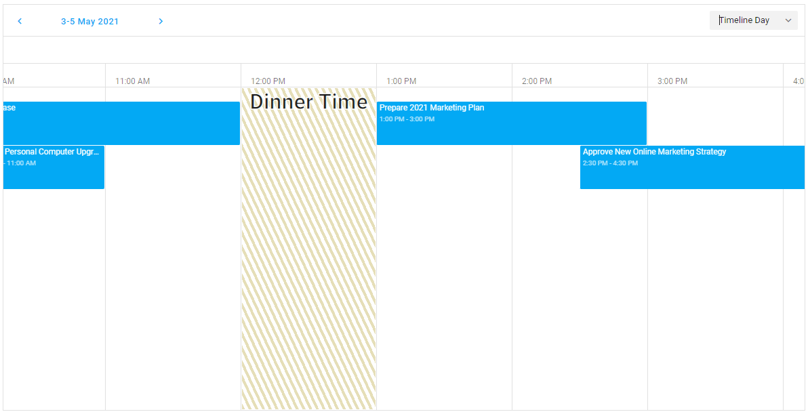

<!-- default badges list -->

<!-- default badges end -->

# Scheduler for DevExtreme - How to disable dates in the timeline view

This example demonstrates how to create a scheduler with disabled dates in the timeline view.

The main idea is to validate the process of adding and updating appointments with the `onAppointmentFormOpening`, `onAppointmentAdding`, and `onAppointmentUpdating` handlers. To visually highlight cells that cannot be edited, set a function for the `dataCellTemplate` property. This function will affect the appointment customization.

## Files to Review

- **Angular**
    - [app.component.html](Angular/src/app/app.component.html)
    - [app.component.ts](Angular/src/app/app.component.ts)
- **jQuery**
    - [index.html](jQuery/src/index.html)
    - [index.js](jQuery/src/index.js)
- **React**
    - [App.js](React/src/App.js)
- **Vue**
    - [App.vue](Vue/src/App.vue)
- **ASP.NET Core**    
    - [Index.cshtml](ASP.NET%20Core/Views/Scheduler/Index.cshtml)

## Documentation

- [Getting Started with Scheduler](https://js.devexpress.com/Documentation/Guide/UI_Components/Scheduler/Getting_Started_with_Scheduler/)

- [Scheduler - API Reference](https://js.devexpress.com/Documentation/ApiReference/UI_Components/dxScheduler/)
<!-- feedback -->
## Does this example address your development requirements/objectives?

 

(you will be redirected to DevExpress.com to submit your response)
<!-- feedback end -->
